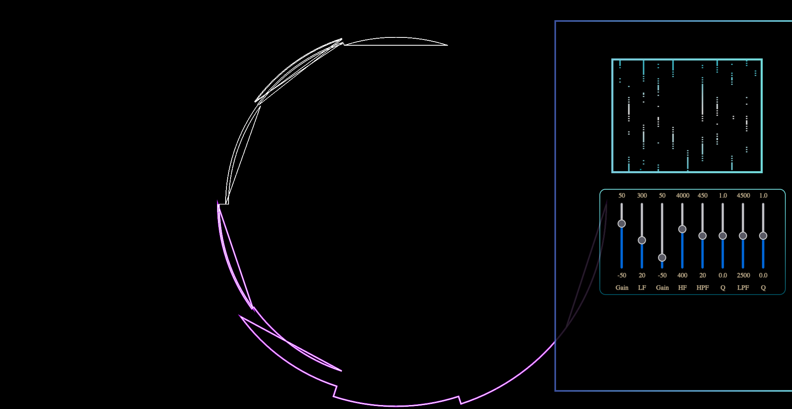

# ZERO | An Audio Visualiztion 
Author : Yong Kim

## Table of Contents
* [API's](#apis)
* [Tuning Parameters](#tuning-parameters)
* [Project Objective](#project-objectives)
* [Wireframe](#wireframe)
* [References](#references)

## Screenshots





## API's
* [Canvas](https://developer.mozilla.org/en-US/docs/Web/API/Canvas_API)
* [AudioNode](https://developer.mozilla.org/en-US/docs/Web/API/AudioNode)
* [Three](https://threejs.org/docs/)

## Tuning Parameters
* Sub frequencies : 20 – 40 Hz
* Low frequencies : 40 – 160 Hz
* Low to Mid frequencies : 160 - 300 Hz
* Mid frequencies : 300 - 1200 Hz
* Mid to High frequencies : 1200 - 2400 Hz 
* High frequencies : 2400 Hz - 5000 Hz
* Vocal frequencies : 100 - 300 Hz [Core Vocal Frequencies] | 1000 - 1400 Hz [Mid Vocal Frequencies] 
* Clap | Snare frequencies : 2200 - 2800 Hz | 250 - 350 Hz & 1000 - 1200 Hz


## Project Objectives
Music has always been apart of mine and many lives. ZERO is an audio visualizer that makes visualizing different
frequencies in songs much more apparent. ZERO allows you to mess around with the EQ of the song you uploaded.
Watch as how different frequencies affect the visualizer.

## Wireframe


## Implementation Timeline
1. Friday : ✔️
- Seperate audio file into frequencies that are managable.
- Create canvas objects based on frequencies levels.
2. Saturday : ✔️
- Tune canvas objects more precisely in order to seperate instruments.
- Create sliders to adjust the shape of the visualizer.
3. Monday : ✔️
- Add a EQ slider to adjust how to song will sound.
- Stylize playbar.
4. Tuesday : ✔️
- Improve style and finalize the project.
5. Wednsday : ✔️
- Create demo GIFS for the github page and finish documentation of project.
6. Thursday : ✔️
- Complete the final look of the project.

## Code Snippets
```js
const barPlay = function(ctx, audio, WIDTH, HEIGHT, visualizer){
    // ANIMATION SEQUENCE SO THEY DONT STACK WITH OTHER VISUALIZERS
    window.animseq = 3;

    // HIGHER BUFFER SIZE WILL CONTAIN MORE INFORMATION
    visualizer.fftSize = 256;

    // INITIATE BASED ON TYPE OF VISUALIZTION
    let bufferLength = visualizer.frequencyBinCount; // Half of fftSize represents the amount of data values
    let dataArray = new Uint8Array(bufferLength);
    let barWidth = (WIDTH / bufferLength) * 2.5;
    let barHeight;
    let x = 0;

    // RENDER VISUALIZATION FUNCTION
    function renderVisualizer(){
        ctx.canvas.width = window.innerWidth;
        ctx.canvas.height = window.innerHeight;
        if (window.animseq === 3){
            x = 0;
            visualizer.getByteFrequencyData(dataArray);
            ctx.fillStyle = "#000";
            ctx.fillRect(0, 0, WIDTH, HEIGHT);
            for (let i = 0; i < bufferLength; i++){
                barHeight = dataArray[i];
                ctx.fillStyle = `rgba(${47},${253},${255},${barHeight / 255})`;
                ctx.fillRect(x , HEIGHT - barHeight, barWidth, barHeight);
                ctx.fillRect(x , HEIGHT - barHeight, barWidth, -1.5 * barHeight);
    
                x += barWidth + 10; // GAP
            }
            requestAnimationFrame(renderVisualizer);
        }  
    }

    // IF SONG IS NOT LOADED VISUALIZER WILL NOT START
    if (visualizer) {
        ctx.clearRect(0,0, WIDTH, HEIGHT);
        renderVisualizer();
    }
}

export { barPlay };
```

## References
* [EQ](https://producerhive.com/music-production-recording-tips/how-to-use-a-vocal-eq-chart/)
* [AudioSpectrum](https://www.google.com/url?sa=i&url=https%3A%2F%2Fwww.sandburgmusic.org%2Faudio-engineering---listening-tools.html&psig=AOvVaw0vux3n5WBVL0LyG05bOKPh&ust=1668207159057000&source=images&cd=vfe&ved=0CA4QjRxqFwoTCLD0w4vapPsCFQAAAAAdAAAAABAJ)
* [Frequencies](https://hushcitysp.com/uncategorized/the-difference-between-low-middle-high-frequency-noise/)
